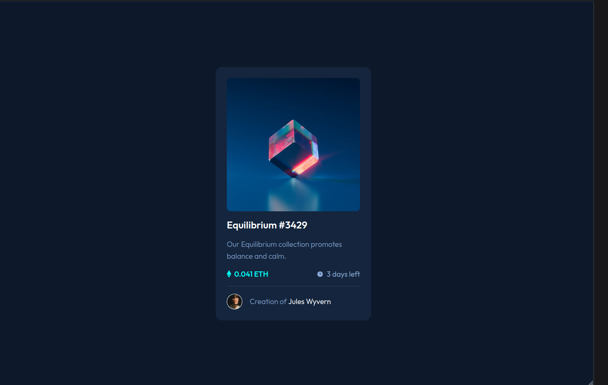

# Frontend Mentor - NFT preview card component solution

This is a solution to the [NFT preview card component challenge on Frontend Mentor](https://www.frontendmentor.io/challenges/nft-preview-card-component-SbdUL_w0U). Frontend Mentor challenges help you improve your coding skills by building realistic projects.

## Table of contents

- [Overview](#overview)
  - [The challenge](#the-challenge)
  - [Screenshot](#screenshot)
  - [Links](#links)
- [My process](#my-process)
  - [Built with](#built-with)
  - [What I learned](#what-i-learned)
  - [Continued development](#continued-development)
  - [Useful resources](#useful-resources)
- [Author](#author)
- [Acknowledgments](#acknowledgments)

**Note: Delete this note and update the table of contents based on what sections you keep.**

## Overview

### The challenge

Users should be able to:

- View the optimal layout depending on their device's screen size
- See hover states for interactive elements

### Screenshot

### Links

- Solution URL: [My solution](https://www.frontendmentor.io/solutions/nft-preview-card-component-using-flexbox-K93Sf24kJe)
- Live Site URL: [Live](https://matiasbastarrica.github.io/NFT-preview-card-component/)

## My process

### Built with

- Semantic HTML5 markup
- CSS custom properties
- Flexbox
- Mobile-first workflow

### What I learned

I was able to use a pseudo-element to change the background and modify the content of the card on hover.

### Continued development

In the future I would like to keep practicing overlapping elements.

### Useful resources

- [order CSS property](https://developer.mozilla.org/en-US/docs/Web/CSS/order) - This article helped me understand that this property can be used in both flexbox and grid layouts.
- [content CSS property](https://developer.mozilla.org/en-US/docs/Web/CSS/content) - I wanted to learn how to add an image to a pseudo-element, and this article helped me understand how to do that.

## Author

- Frontend Mentor - [@MatiasBastarrica](https://www.frontendmentor.io/profile/MatiasBastarrica)
